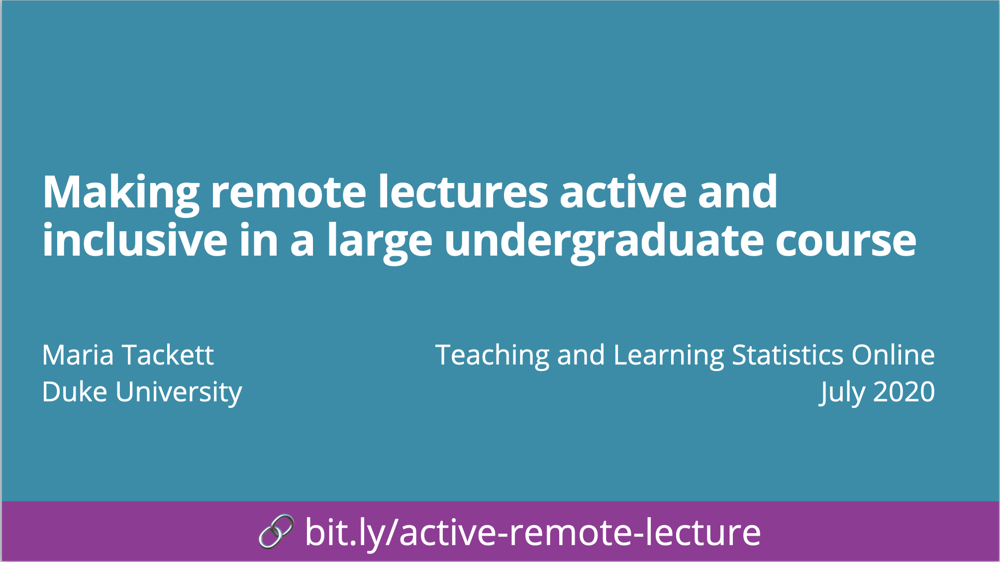

# Making remote lectures active and inclusive in a large undergraduate course

## Abstract

In this talk we’ll share how we adapted face-to-face lectures for remote learning by including both synchronous (“live lecture”) and asynchronous (“lecture content videos”) components. We’ll present ideas for engaging a large class during the live lecture by using technology to facilitate discussion and active learning. We’ll discuss what worked well and what could be improved based on the experience of using this format in Spring 2020. Looking ahead to the fall semester, we conclude with practical considerations for implementing this lecture format in a way that strives to foster equitable learning opportunities for students taking the course in a variety of learning environments.

## Slides

Click to access slides.

## Resources for remote teaching

### Lectures

- [Teaching online on short notice](https://education.rstudio.com/blog/2020/03/teaching-online-on-short-notic) by Greg Wilson
- [Flex Teaching: A Guide to Course Delivery](https://flexteaching.li.duke.edu/a-guide-to-course-delivery/) by Duke Learning Innovation
- [Tips for live teaching tech online, deeply informed by the Carpentries](https://elizabethwickes.com/2020/03/12/tips-for-live-teaching-tech-online-deeply-informed-by-the-carpentries/) by Elizabeth Wickes
- [6 tips for creating engaging video lectures that students will actually watch](https://teaching.temple.edu/edvice-exchange/2016/03/6-tips-creating-engaging-video-lectures-students-will-actually-watch) by Simuelle Myers

### Course materials
- [Resources for teaching (with) R remotely](https://education.rstudio.com/blog/2020/03/resources-for-teaching-data-science-and-statistics-remotely/) by Mine Çetinkaya-Rundel
- [Penn State online teaching tips](https://online.stat.psu.edu/statprogram/faculty/tips)
- [Sharing on short notice: how to get your teaching materials online with R markdown](https://education.rstudio.com/blog/2020/04/sharing-on-short-notice/) by Alison Hill and Desirée De Leon
- [Data Science in a Box](https://datasciencebox.org/) by Mine Çetinkaya-Rundel
